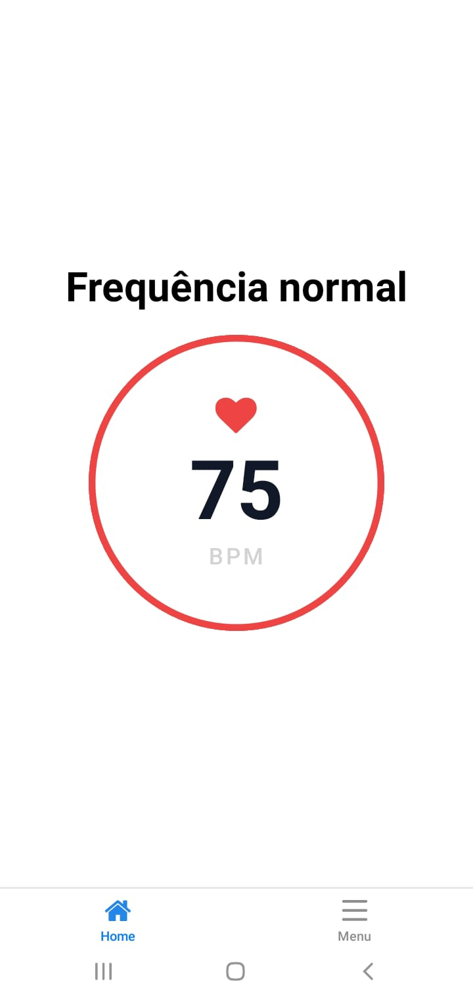
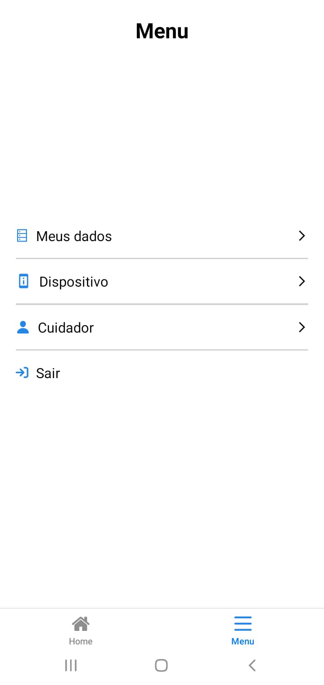
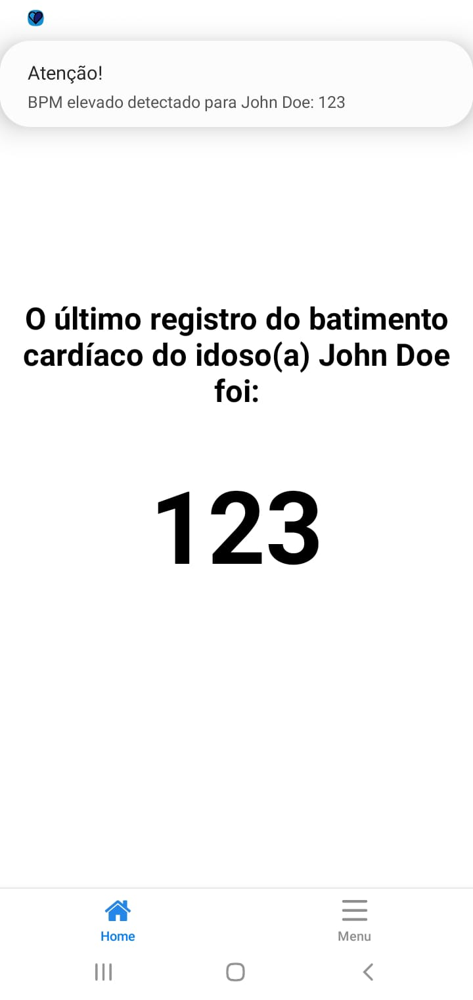

# Prev Heart App

Aplicativo de monitoramento de batimento cardíaco feito em \*\*React Native com Expo, usando TypeScript, Context API e React Query".

## Objetivo

A proposta do aplicativo é monitorar o nível de batimento cardíaco de um idoso e, caso o nível esteja elevado - maior que 120 bpm -, enviar uma notificação para o telefone do cuidador, o qual é responsável pelo idoso - este vínculo é feito no aplicativo.

## Funcionalidades

- Cadastro e login
- Persistência de sessão do usuário
- Push notification
- Vínculo entre cuidador e idoso
- Registro de dispositivo
- Monitoramento real-time do valor do batimento cardíaco para ambos os usuários.
- Integração com API REST

## Tecnologias

- React Native 0.81.4
- Expo 54
- TypeScript 5.9.2
- Expo router 6.0.3
- Expo notification 0.32.11
- @tanstack/react-query 5.87.1
- @react-native-async-storage/async-storage 2.2

## Screenshots principais





Mais capturas de tela de demonstração podem ser encontrados na pasta [docs](./docs/).

## Instalação e uso

### 1️⃣ Backend (API)

Antes de rodar o app mobile, você precisa iniciar a API.

- **Repositório da API:** https://github.com/William01br/prev-heart
- **Pré-requisitos:** Docker

**Passos**:

```bash
# Clonar o repositório da API
git clone git@github.com:William01br/prev-heart.git
cd prev-heart

# Instalar dependências
npm install

# Configurar variáveis de ambiente
cp .env.example .env # ou renomeie manualmente

# A API + banco vai subir via docker (modo desenvolvimento)
docker compose up --build -d
docker logs -f backend_prev_heart # olhar os logs da api
```

A API ficará acessível em http://localhost:3000 (ou na porta configurada em `.env`).

### 2️⃣ Frontend (App Mobile)

Com a API em execução, agora rode o app mobile

- **Pré-requisitos**: Expo CLI

```bash
npm install --global expo-cli
```

- **Passos**:

```bash
# Clonar o app
git clone git@github.com:William01br/prev-heart-app.git
cd prev-heart-app

# Instalar dependências
npm install

# Configurar variáveis de ambiente
cp .env.example .env # ou renomeie manualmente
# Abra o arquivo .env e ajuste a URL da API, ex:
EXPO_PUBLIC_API_URL=http://localhost:3000

# Iniciar o Expo
npx expo start
```

Use o app **Expo Go** no celular (Android/iOS) para escanear o QR Code exibido no terminal ou no navegador.

## Download

Baixe a versão mais recente em [Releases](https://github.com/William01br/prev-heart-app/releases).
